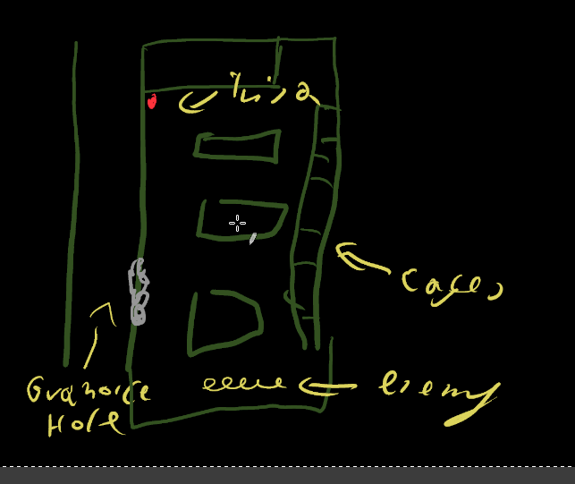

# Common-space
Used to be a show of space with swimming pools fish animals and fountains but has since become a space for wars between families of those that were taken by [[Glenn's-petal|glenn's-petal]].

PC can find a traces of previous implementation of [[Glenn's-petal|glenn's-petal]] as a places where mushrooms were picked or animals that were repetitively caught 

Place is filled with little bungalows where business for outsiders were done.

## observer

Fighting is taken by a info morph that set themself at the weather station computer [[Dina-Serafim|Dina]]. When PC will enter the space She will try to contact them and try to talk the situation. Will have a request to disable one of "infected" without harming the body since it's her boyfriend and he likes the body. After this will try to help as much as possible.

## map

