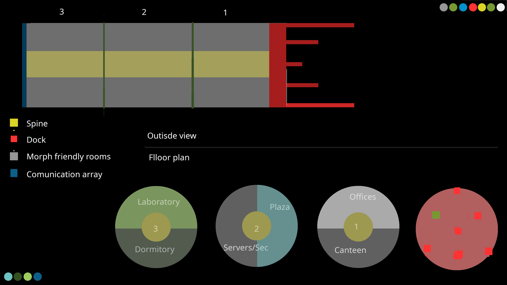

## Description

Station is the shape of cylinder that is spun to achieve 0.9G.
From outside on non port site you have communication array.

## Outside plan

## Entry points

PC can enter using small spaceship given by [[Firewall|firewall]] or enter any side of station using drop suits and entry bubble.

